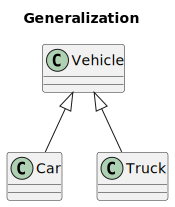
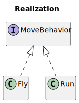
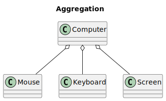
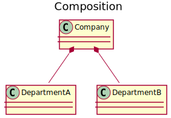
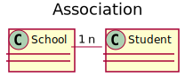
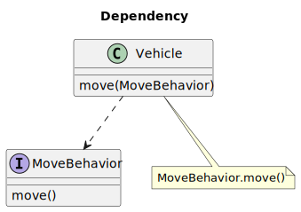

设计模式基础

## [UML 建模基础](https://design-patterns.readthedocs.io/zh-cn/latest/read_uml.html)

## 类图

### 泛化关系
用于描述继承关系，Java 中用 extends 关键字。

### 实现关系
用于实现一个接口，在 Java 中使用 Implements 关键字。

### 聚合关系
表示整体由部分组成，但是整体和部分不是强依赖的，整体不存在了部分还是会存在。

### 组合关系
也表示整体和部分之间的关系，但是和聚合不同。组合关系中部分和整体是强依赖的，整体不存在了，不分也就不存在了。组合关系中，部分的声明周期和整体是一致的，部分由整体构造并在整体销毁的时候同时被销毁。例如公司和部门之间是组合关系，但是公司和员工之间是聚合关系，公司不在了员工还在。

### 关联关系
表示不同类对象之间有关联，这是一种静态关系，与运行过程的状态无关，在最开始就可以确定。因此也可以用 1 对 1、多对 1、多对多这种关联关系来表示。比如学生和学校就是一种关联关系，一个学校可以有很多学生，但是一个学生只属于一个学校，因此这是一种多对一的关系，在运行开始之前就可以确定。

### 依赖关系
和关联关系不同的是，依赖关系是在运行过程中起作用的。A 类和 B 类是依赖关系主要有三种形式:
● A 类是 B 类中的(某中方法的)局部变量；
● A 类是 B 类方法当中的一个参数；
● A 类向 B 类发送消息，从而影响 B 类发生变化；

